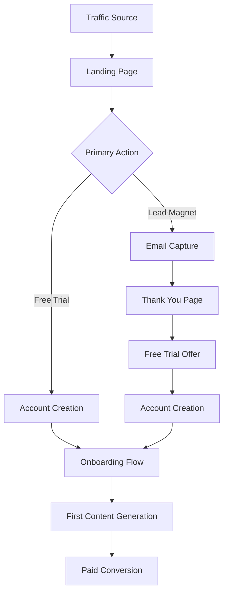

# 🎨 Landing Page Architecture - AI Media Consultant Platform

## 📋 Executive Summary

This document outlines the comprehensive architectural design for the AI Media Consultant Platform landing page, targeting Indonesian SMEs, personal brands, and startups. The design focuses on lead magnet downloads as primary conversion with free trial signups as secondary conversion, incorporating Indonesian market preferences and cultural considerations.

## 🎯 Information Architecture & Content Hierarchy

### Primary User Journey Flow
```mermaid
graph TD
    A[Landing Page Visit] --> B{User Segment}
    B -->|UMKM| C[Cost Savings Focus]
    B -->|Personal Brand| D[Quality & Consistency Focus]
    B -->|Startup| E[Scalability Focus]
    
    C --> F[Lead Magnet: "Panduan Strategi Konten UMKM"]
    D --> G[Lead Magnet: "Content Creator's Toolkit"]
    E --> H[Lead Magnet: "Startup Growth Content Guide"]
    
    F --> I[Email Capture]
    G --> I
    H --> I
    
    I --> J[Thank You + Free Trial Offer]
    J --> K[Platform Onboarding]
```

### Content Hierarchy Structure

#### 1. **Hero Section** (Above the fold)
- **Primary Headline**: "Buat Konten Media Sosial 1 Minggu Hanya dalam 10 Menit"
- **Secondary Headline**: "Platform AI yang menggantikan Social Media Manager dengan biaya 90% lebih murah"
- **Value Proposition**: Cost savings + Time efficiency + Quality consistency
- **Primary CTA**: "Download Panduan Gratis" (Lead Magnet)
- **Secondary CTA**: "Coba Gratis 7 Hari"
- **Trust Indicators**: "Dipercaya 2,500+ UMKM Indonesia"

#### 2. **Problem-Solution Section**
- **Problem Statement**: Current pain points of target audience
- **Solution Overview**: AI-powered multi-platform content generation
- **Benefit Highlights**: Speed, Cost, Quality, Consistency

#### 3. **Key Benefits/Features Section**
- **Feature Cards** (6 main features):
  1. Multi-Platform Generation (Instagram, LinkedIn, TikTok)
  2. AI Multi-Agent System
  3. Brand Voice Consistency
  4. Indonesian Language Optimization
  5. Cost-Effective Pricing
  6. Quality Assurance

#### 4. **Social Proof Section**
- **Customer Testimonials**: 3-4 testimonials from different segments
- **Success Metrics**: User statistics and results
- **Case Studies**: Brief success stories
- **Trust Badges**: Security, compliance, partnerships

#### 5. **Pricing Preview Section**
- **Pricing Comparison**: Traditional vs AI Media Consultant
- **Value Demonstration**: ROI calculator
- **Pricing Tiers**: Simplified overview with CTA to detailed pricing

#### 6. **Lead Magnet Section**
- **Content Offer**: "Panduan Lengkap Strategi Konten Media Sosial 2025"
- **Value Proposition**: What they'll learn
- **Email Capture Form**: Name, Email, Business Type
- **Privacy Assurance**: GDPR compliance statement

#### 7. **Footer**
- **Contact Information**: Email, WhatsApp, Address
- **Social Media Links**: Instagram, LinkedIn, YouTube
- **Legal Links**: Privacy Policy, Terms of Service
- **Company Information**: About, Careers, Blog

## 🎨 Visual Design System

### Color Scheme (Indonesian Market Optimized)

#### Primary Palette
- **Primary Blue**: `#1E40AF` (Trust, Technology, Professional)
- **Secondary Green**: `#059669` (Growth, Success, Money Savings)
- **Accent Orange**: `#EA580C` (Energy, Action, Indonesian warmth)
- **Neutral Gray**: `#374151` (Text, Professional balance)

#### Supporting Colors
- **Light Blue**: `#DBEAFE` (Backgrounds, highlights)
- **Light Green**: `#D1FAE5` (Success states, savings highlights)
- **Light Orange**: `#FED7AA` (CTA hover states, warmth)
- **White**: `#FFFFFF` (Clean backgrounds)
- **Dark**: `#111827` (Headers, important text)

#### Cultural Considerations
- **Red accents** (`#DC2626`) for urgency/limited offers (Indonesian e-commerce familiarity)
- **Gold accents** (`#F59E0B`) for premium features (cultural association with value)

### Typography Hierarchy

#### Font Selection
- **Primary Font**: Inter (Modern, readable, international appeal)
- **Secondary Font**: Plus Jakarta Sans (Indonesian-designed, local connection)
- **Accent Font**: Poppins (Friendly, approachable for CTAs)

#### Typography Scale
```css
/* Headlines */
.hero-headline: 48px/52px, font-weight: 700, Plus Jakarta Sans
.section-headline: 36px/40px, font-weight: 600, Plus Jakarta Sans
.subsection-headline: 24px/28px, font-weight: 600, Inter

/* Body Text */
.body-large: 18px/28px, font-weight: 400, Inter
.body-regular: 16px/24px, font-weight: 400, Inter
.body-small: 14px/20px, font-weight: 400, Inter

/* UI Elements */
.button-text: 16px/20px, font-weight: 600, Poppins
.caption: 12px/16px, font-weight: 400, Inter
.label: 14px/16px, font-weight: 500, Inter
```

#### Indonesian Localization
- **Bahasa Indonesia** as primary language
- **English terms** for technical features (familiar to target audience)
- **Mixed language approach** for modern Indonesian business communication

## 📱 Responsive Breakpoint Strategy

### Breakpoint System
```css
/* Mobile First Approach */
.mobile: 320px - 767px
.tablet: 768px - 1023px
.desktop: 1024px - 1439px
.large-desktop: 1440px+

/* Specific breakpoints for key elements */
.hero-breakpoint: 640px (hero layout change)
.features-breakpoint: 768px (feature cards grid change)
.testimonials-breakpoint: 1024px (testimonial layout change)
```

### Layout Adaptations

#### Mobile (320px - 767px)
- **Single column layout**
- **Stacked hero elements**
- **Simplified navigation** (hamburger menu)
- **Touch-optimized CTAs** (minimum 44px height)
- **Condensed feature cards** (1 column)
- **Simplified testimonials** (carousel)

#### Tablet (768px - 1023px)
- **Two-column layout** for features
- **Side-by-side hero elements**
- **Expanded navigation**
- **Grid-based testimonials** (2 columns)
- **Enhanced visual hierarchy**

#### Desktop (1024px+)
- **Multi-column layouts**
- **Full hero section** with visual elements
- **Complete navigation menu**
- **Grid-based feature cards** (3 columns)
- **Full testimonial display** (3-4 columns)

### Performance Considerations
- **Critical CSS inlining** for above-the-fold content
- **Progressive image loading** with WebP format
- **Lazy loading** for below-the-fold sections
- **Optimized font loading** with font-display: swap

## 🏗️ Page Layout & Section Organization

### Section Flow & Spacing
```
┌─────────────────────────────────────────┐
│ Navigation Bar (Sticky)                 │ 80px
├─────────────────────────────────────────┤
│ Hero Section                            │ 100vh (mobile: 80vh)
├─────────────────────────────────────────┤
│ Problem-Solution Section                │ 600px
├─────────────────────────────────────────┤
│ Key Benefits/Features Section           │ 800px
├─────────────────────────────────────────┤
│ Social Proof Section                    │ 700px
├─────────────────────────────────────────┤
│ Pricing Preview Section                 │ 600px
├─────────────────────────────────────────┤
│ Lead Magnet Section (Sticky CTA)        │ 500px
├─────────────────────────────────────────┤
│ Footer                                  │ 400px
└─────────────────────────────────────────┘
```

### Grid System
- **12-column grid** for desktop
- **8-column grid** for tablet
- **4-column grid** for mobile
- **Container max-width**: 1200px
- **Gutter width**: 24px (desktop), 16px (mobile)

### Visual Hierarchy Principles
1. **F-Pattern Layout** for content scanning
2. **Z-Pattern** for hero section
3. **Progressive disclosure** for complex information
4. **Visual weight distribution** using color and typography
5. **White space utilization** for breathing room

## ⚡ Performance Optimization Strategy

### Core Web Vitals Targets
- **Largest Contentful Paint (LCP)**: < 2.5s
- **First Input Delay (FID)**: < 100ms
- **Cumulative Layout Shift (CLS)**: < 0.1

### Optimization Techniques

#### 1. **Image Optimization**
```javascript
// Modern image formats with fallbacks
<picture>
  <source srcset="hero-image.avif" type="image/avif">
  <source srcset="hero-image.webp" type="image/webp">
  
</picture>
```

#### 2. **Critical Resource Loading**
- **Preload critical fonts**: Plus Jakarta Sans, Inter
- **Preconnect to external domains**: Google Fonts, CDNs
- **Inline critical CSS** for above-the-fold content
- **Defer non-critical JavaScript**

#### 3. **Code Splitting & Bundling**
- **Route-based code splitting**
- **Component-level lazy loading**
- **Tree shaking** for unused code elimination
- **Modern JavaScript** with legacy fallbacks

#### 4. **Caching Strategy**
- **Static assets**: 1 year cache
- **HTML**: 5 minutes cache
- **API responses**: 15 minutes cache
- **CDN distribution**: Global edge locations

#### 5. **Third-Party Optimization**
- **Lazy load analytics** scripts
- **Optimize Google Fonts** loading
- **Minimize external dependencies**
- **Use resource hints** (preconnect, dns-prefetch)

## 🎯 Content Strategy for Each Section

### 1. Hero Section Content
```
Headline: "Buat Konten Media Sosial 1 Minggu Hanya dalam 10 Menit"
Subheadline: "Platform AI yang menggantikan Social Media Manager dengan biaya 90% lebih murah"

Value Props:
• ⚡ Generate konten 1 minggu dalam 10 menit
• 💰 Hemat biaya hingga 90% vs hiring team
• 🎨 Konsisten di semua platform (IG, LinkedIn, TikTok)
• 🇮🇩 Dioptimalkan untuk pasar Indonesia

CTA Primary: "Download Panduan Gratis"
CTA Secondary: "Mulai Trial 7 Hari Gratis"
Trust Signal: "Dipercaya 2,500+ UMKM Indonesia"
```

### 2. Problem-Solution Content
```
Problem Statement:
"Apakah Anda menghabiskan berjam-jam membuat konten media sosial tapi hasilnya tidak konsisten?"

Pain Points:
• Butuh 3-5 jam per hari untuk buat konten
• Biaya Social Media Manager Rp 5-8jt/bulan
• Sulit maintain konsistensi brand voice
• Tidak tahu konten apa yang engaging

Solution Overview:
"AI Media Consultant menggunakan sistem multi-agent AI untuk menghasilkan konten berkualitas tinggi dalam hitungan menit, bukan jam."
```

### 3. Features Content Strategy
```
Feature 1: Multi-Platform Generation
Icon: 📱 Platform icons
Title: "Satu Platform, Semua Media Sosial"
Description: "Generate konten untuk Instagram, LinkedIn, dan TikTok sekaligus dengan optimasi khusus setiap platform"

Feature 2: AI Multi-Agent System
Icon: 🤖 AI brain
Title: "AI Specialist untuk Setiap Platform"
Description: "Tim AI specialist yang bekerja sama: Content Strategist, Platform Specialist, Brand Voice Guardian"

Feature 3: Brand Voice Consistency
Icon: 🎭 Brand identity
Title: "Brand Voice yang Konsisten"
Description: "AI memahami dan mempertahankan tone of voice brand Anda di semua konten dan platform"

Feature 4: Indonesian Optimization
Icon: 🇮🇩 Indonesian flag
Title: "Dioptimalkan untuk Pasar Indonesia"
Description: "Memahami budaya, bahasa, dan preferensi audience Indonesia untuk engagement maksimal"

Feature 5: Cost-Effective Pricing
Icon: 💰 Money savings
Title: "90% Lebih Hemat dari Hiring Team"
Description: "Mulai dari Rp 299k/bulan vs Rp 8-13jt/bulan untuk Social Media Manager + Content Creator"

Feature 6: Quality Assurance
Icon: ✅ Quality check
Title: "Quality Assurance Otomatis"
Description: "Setiap konten melalui AI Quality Assurance untuk memastikan grammar, engagement, dan brand compliance"
```

### 4. Social Proof Content
```
Testimonial 1 (UMKM Owner):
"Sejak pakai AI Media Consultant, engagement Instagram naik 300% dan saya hemat 15 jam per minggu. ROI-nya luar biasa!"
- Sari Dewi, Owner Batik Nusantara

Testimonial 2 (Personal Brand):
"Konten LinkedIn saya jadi lebih profesional dan konsisten. Follower naik dari 2K ke 15K dalam 6 bulan."
- Ahmad Rizki, Digital Marketing Consultant  

Testimonial 3 (Startup):
"Platform ini game-changer untuk startup seperti kami. Bisa fokus ke product development tanpa khawatir content marketing."
- Lisa Chen, Co-founder TechStart Indonesia

Success Metrics:
• 2,500+ Active Users
• 150,000+ Content Generated
• 4.8/5 User Satisfaction
• 90% Cost Reduction Average
```

### 5. Lead Magnet Content
```
Offer Title: "Panduan Lengkap Strategi Konten Media Sosial 2025"

Value Proposition:
"Download gratis panduan 50+ halaman yang berisi:"
✅ Template konten untuk 12 bulan
✅ Strategi hashtag yang terbukti efektif
✅ Calendar posting optimal untuk setiap platform
✅ 100+ ide konten untuk berbagai industri
✅ Cara mengukur ROI content marketing

Form Fields:
• Nama Lengkap
• Email Address
• Jenis Bisnis (dropdown)
• Ukuran Bisnis (dropdown)

Privacy Note: "Kami menghormati privasi Anda. Email hanya untuk mengirim panduan dan tips marketing berkualitas."
```

## 🔄 Conversion Funnel & CTA Placement

### Conversion Funnel Strategy


### CTA Placement Strategy

#### Primary CTAs (Lead Magnet)
1. **Hero Section**: Above the fold, prominent placement
2. **After Problem Statement**: When pain is established
3. **Lead Magnet Section**: Dedicated section with form
4. **Sticky CTA**: Floating button on scroll
5. **Footer**: Final opportunity

#### Secondary CTAs (Free Trial)
1. **Hero Section**: Secondary button
2. **After Features**: When value is demonstrated
3. **After Social Proof**: When trust is established
4. **Pricing Section**: Natural placement

#### CTA Design Principles
- **Primary CTA**: Orange (#EA580C) for warmth and action
- **Secondary CTA**: Blue outline (#1E40AF) for trust
- **Button Text**: Action-oriented, benefit-focused
- **Size**: Minimum 44px height for mobile
- **Contrast**: WCAG AA compliant

### A/B Testing Strategy
```
Test 1: Hero CTA Text
A: "Download Panduan Gratis"
B: "Dapatkan Panduan Gratis Sekarang"

Test 2: Lead Magnet Positioning
A: Dedicated section mid-page
B: Sticky sidebar form

Test 3: Social Proof Format
A: Traditional testimonials
B: Video testimonials

Test 4: Pricing Display
A: Comparison table
B: ROI calculator focus
```

## 🌏 Localization & Cultural Elements

### Indonesian Market Adaptations

#### 1. **Language Strategy**
- **Primary Language**: Bahasa Indonesia (formal but approachable)
- **Technical Terms**: English terms that are familiar (AI, platform, content)
- **Call-to-Actions**: Indonesian with urgency markers
- **Social Proof**: Local names and businesses

#### 2. **Cultural Design Elements**
- **Color Psychology**: 
  - Red for urgency (familiar from e-commerce)
  - Gold for premium value
  - Green for money savings and success
- **Visual Style**: Clean, modern, professional (Indonesian business preference)
- **Icons**: Universal symbols with local context

#### 3. **Business Context Adaptations**
- **UMKM Focus**: Emphasize cost savings and simplicity
- **Local Success Stories**: Indonesian business examples
- **Payment Methods**: Local payment options (GoPay, OVO, Bank Transfer)
- **Support Channels**: WhatsApp integration (preferred communication)

#### 4. **Trust Building Elements**
- **Local Testimonials**: Real Indonesian business owners
- **Indonesian Address**: Physical presence indication
- **Local Phone Number**: +62 format
- **Compliance Mentions**: Indonesian data protection laws

### Content Localization Examples
```
Global: "Save time and money"
Indonesian: "Hemat waktu dan biaya operasional"

Global: "Try free for 7 days"
Indonesian: "Coba gratis 7 hari tanpa komitmen"

Global: "Trusted by businesses"
Indonesian: "Dipercaya ribuan UMKM Indonesia"

Global: "Get started now"
Indonesian: "Mulai sekarang juga"
```

## 🛠️ Technical Implementation Guidelines

### Frontend Technology Stack
```javascript
// Recommended stack
Framework: Next.js 14 (React-based, SEO optimized)
Styling: Tailwind CSS (utility-first, responsive)
Animations: Framer Motion (smooth interactions)
Forms: React Hook Form (performance optimized)
Analytics: Google Analytics 4 + Hotjar
```

### HTML Structure Template
```html
<!DOCTYPE html>
<html lang="id">
<head>
    <meta charset="UTF-8">
    <meta name="viewport" content="width=device-width, initial-scale=1.0">
    <title>AI Media Consultant - Platform AI untuk Konten Media Sosial</title>
    <meta name="description" content="Buat konten media sosial 1 minggu hanya dalam 10 menit. Hemat 90% biaya vs hiring team. Coba gratis 7 hari.">
    
    <!-- Preconnect to external domains -->
    <link rel="preconnect" href="https://fonts.googleapis.com">
    <link rel="preconnect" href="https://fonts.gstatic.com" crossorigin>
    
    <!-- Critical CSS inline -->
    <style>/* Critical CSS here */</style>
    
    <!-- Preload critical resources -->
    <link rel="preload" href="/fonts/plus-jakarta-sans.woff2" as="font" type="font/woff2" crossorigin>
</head>
<body>
    <!-- Navigation -->
    <nav class="sticky top-0 z-50 bg-white shadow-sm">
        <!-- Navigation content -->
    </nav>
    
    <!-- Hero Section -->
    <section class="hero-section min-h-screen flex items-center">
        <!-- Hero content -->
    </section>
    
    <!-- Problem-Solution Section -->
    <section class="problem-solution py-20">
        <!-- Content -->
    </section>
    
    <!-- Features Section -->
    <section class="features py-20 bg-gray-50">
        <!-- Feature cards -->
    </section>
    
    <!-- Social Proof Section -->
    <section class="social-proof py-20">
        <!-- Testimonials -->
    </section>
    
    <!-- Pricing Section -->
    <section class="pricing py-20 bg-blue-50">
        <!-- Pricing content -->
    </section>
    
    <!-- Lead Magnet Section -->
    <section class="lead-magnet py-20 bg-orange-50">
        <!-- Email capture form -->
    </section>
    
    <!-- Footer -->
    <footer class="footer py-16 bg-gray-900 text-white">
        <!-- Footer content -->
    </footer>
    
    <!-- Sticky CTA -->
    <div class="sticky-cta fixed bottom-4 right-4 z-40">
        <!-- Floating CTA button -->
    </div>
</body>
</html>
```

### CSS Architecture
```css
/* Tailwind CSS configuration */
module.exports = {
  content: ['./src/**/*.{js,ts,jsx,tsx}'],
  theme: {
    extend: {
      colors: {
        primary: {
          50: '#eff6ff',
          500: '#1e40af',
          600: '#1d4ed8',
          700: '#1e3a8a',
        },
        secondary: {
          50: '#ecfdf5',
          500: '#059669',
          600: '#047857',
        },
        accent: {
          50: '#fff7ed',
          500: '#ea580c',
          600: '#dc2626',
        }
      },
      fontFamily: {
        'jakarta': ['Plus Jakarta Sans', 'sans-serif'],
        'inter': ['Inter', 'sans-serif'],
        'poppins': ['Poppins', 'sans-serif'],
      },
      animation: {
        'fade-in-up': 'fadeInUp 0.6s ease-out',
        'slide-in-right': 'slideInRight 0.8s ease-out',
      }
    },
  },
  plugins: [
    require('@tailwindcss/forms'),
    require('@tailwindcss/typography'),
  ],
}
```

### Performance Monitoring
```javascript
// Core Web Vitals monitoring
import { getCLS, getFID, getFCP, getLCP, getTTFB } from 'web-vitals';

function sendToAnalytics(metric) {
  gtag('event', metric.name, {
    event_category: 'Web Vitals',
    value: Math.round(metric.name === 'CLS' ? metric.value * 1000 : metric.value),
    event_label: metric.id,
    non_interaction: true,
  });
}

getCLS(sendToAnalytics);
getFID(sendToAnalytics);
getFCP(sendToAnalytics);
getLCP(sendToAnalytics);
getTTFB(sendToAnalytics);
```

### SEO Implementation
```javascript
// Next.js SEO configuration
export const seoConfig = {
  title: 'AI Media Consultant - Platform AI untuk Konten Media Sosial',
  description: 'Buat konten media sosial 1 minggu hanya dalam 10 menit. Hemat 90% biaya vs hiring team. Coba gratis 7 hari.',
  canonical: 'https://aimediaconsultant.id',
  openGraph: {
    type: 'website',
    locale: 'id_ID',
    url: 'https://aimediaconsultant.id',
    siteName: 'AI Media Consultant',
    title: 'AI Media Consultant - Platform AI untuk Konten Media Sosial',
    description: 'Buat konten media sosial 1 minggu hanya dalam 10 menit. Hemat 90% biaya vs hiring team.',
    images: [
      {
        url: 'https://aimediaconsultant.id/og-image.jpg',
        width: 1200,
        height: 630,
        alt: 'AI Media Consultant Platform',
      },
    ],
  },
  twitter: {
    handle: '@aimediaconsultant',
    site: '@aimediaconsultant',
    cardType: 'summary_large_image',
  },
};
```

## 📊 Success Metrics & KPIs

### Primary Metrics
- **Lead Magnet Conversion Rate**: Target 15-25%
- **Free Trial Signup Rate**: Target 3-5%
- **Email-to-Trial Conversion**: Target 20-30%
- **Page Load Speed**: < 3 seconds
- **Mobile Usability Score**: > 95

### Secondary Metrics
- **Time on Page**: > 2 minutes
- **Scroll Depth**: > 75%
- **Bounce Rate**: < 40%
- **Social Shares**: Track viral coefficient
- **Form Completion Rate**: > 80%

### A/B Testing Framework
```javascript
// Testing implementation
const experiments = {
  hero_cta_text: {
    variants: ['Download Panduan Gratis', 'Dapatkan Panduan Gratis Sekarang'],
    traffic_split: 50,
    success_metric: 'lead_magnet_conversion'
  },
  pricing_display: {
    variants: ['comparison_table', 'roi_calculator'],
    traffic_split: 50,
    success_metric: 'trial_signup_rate'
  }
};
```

## 🚀 Implementation Roadmap

### Phase 1: Foundation (Week 1-2)
- [ ] Set up Next.js project with Tailwind CSS
- [ ] Implement responsive grid system
- [ ] Create component library
- [ ] Set up analytics and monitoring

### Phase 2: Core Sections (Week 3-4)
- [ ] Build hero section with CTAs
- [ ] Implement features section
- [ ] Create social proof section
- [ ] Build lead magnet form

### Phase 3: Optimization (Week 5-6)
- [ ] Performance optimization
- [ ] SEO implementation
- [ ] A/B testing setup
- [ ] Mobile optimization

### Phase 4: Launch (Week 7-8)
- [ ] User testing and feedback
- [ ] Final optimizations
- [ ] Launch preparation
- [ ] Monitoring setup

---

**This comprehensive architecture provides a solid foundation for building a high-converting, culturally-appropriate landing page that serves the Indonesian market while maintaining modern web standards and performance optimization.**